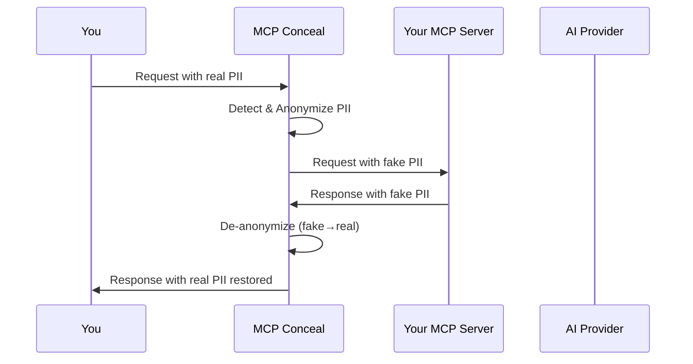

# MCP Conceal

An MCP proxy that pseudo-anonymizes PII before data reaches external AI providers and **de-anonymizes responses** so you see real values.



MCP Conceal performs pseudo-anonymization rather than redaction to preserve semantic meaning and data relationships required for AI analysis. Example: `john.smith@acme.com` becomes `tomas@example.org`, maintaining structure while protecting sensitive information. Responses are automatically de-anonymized before reaching you.

## Quick Start

### Prerequisites

Install Ollama for LLM-based PII detection:

1. Install Ollama: [ollama.ai](https://ollama.ai)
2. Pull model: `ollama pull qwen2.5:1.5b-instruct-q4_K_M`
3. Verify: `curl http://localhost:11434/api/version`

### Basic Usage

Run as proxy in front of any MCP server:

```bash
mcp-server-conceal \
  --target-command python3 \
  --target-args "my-mcp-server.py"
```

A default config is auto-created at `~/.config/mcp-server-conceal/mcp-server-conceal.toml`.

## LLM Model Selection

The LLM is used to detect PII that regex patterns miss (names, addresses, contextual data). An **instruct model** is required because the proxy sends structured prompts asking the model to identify and return PII entities in JSON format.

### Recommended Models

| Model | Size | Best for |
|-------|------|----------|
| `qwen2.5:1.5b-instruct-q4_K_M` | ~1GB | Low storage, fast, good for structured PII |
| `qwen2.5:3b-instruct-q4_K_M` | ~2GB | Better name/address detection |
| `llama3.2:3b` | ~2GB | Well-rounded, original default |
| `phi-4-mini` | ~2.5GB | Strong reasoning at small size |

**Why instruct models?** The proxy sends prompts like "identify PII entities in this text and return them as JSON." Instruct-tuned models reliably follow this format. Base/pretrained models may not produce structured output.

**When the LLM matters:** Regex already catches emails, phones, SSNs, credit cards, and IPs with zero latency. The LLM only handles what regex can't — primarily **names and unstructured contextual PII**. If your data is mostly structured, the 1.5B model is sufficient.

Configure in `mcp-server-conceal.toml`:

```toml
[llm]
model = "qwen2.5:1.5b-instruct-q4_K_M"
endpoint = "http://localhost:11434"
```

## De-anonymization

Responses from the AI are automatically de-anonymized. The proxy maintains a reverse mapping database (fake → real) and replaces fake values in AI responses with the originals before showing them to you.

This means:
- The AI only ever sees fake PII
- You always see real values in responses
- The mapping is stored locally in SQLite (`~/.local/share/mcp-server-conceal/mappings.db`)

## Detection Modes

| Mode | Latency | Accuracy | Configure |
|------|---------|----------|-----------|
| `regex_llm` (default) | 100-500ms | High | Regex first, LLM for remainder |
| `regex` | <10ms | Good for structured PII | Pattern matching only |
| `llm` | 200-1000ms | Best for unstructured text | AI-only detection |

## Building from Source

```bash
git clone https://github.com/jsntn/mcp-server-conceal
cd mcp-server-conceal
cargo build --release
```

Requires Rust 1.85+. Binary: `target/release/mcp-server-conceal`

## Configuration

See `mcp-server-conceal.example.toml` for all options.

## Claude Desktop / MCP Client Integration

```json
{
  "mcpServers": {
    "database": {
      "command": "mcp-server-conceal",
      "args": [
        "--target-command", "python3",
        "--target-args", "database-server.py --host localhost",
        "--config", "/path/to/mcp-server-conceal.toml"
      ]
    }
  }
}
```

## Security

- **Mapping database** contains real-to-fake mappings. Secure with file permissions.
- **Reverse mappings** contain plaintext originals. Protect `~/.local/share/mcp-server-conceal/`.
- **LLM runs locally** via Ollama — no data leaves your machine.

## License

MIT License - see LICENSE file for details.

## Credits

Originally created by [Gianluca Brigandi](https://github.com/gbrigandi/mcp-server-conceal). This fork adds de-anonymization support and switches to a smaller default LLM model.
