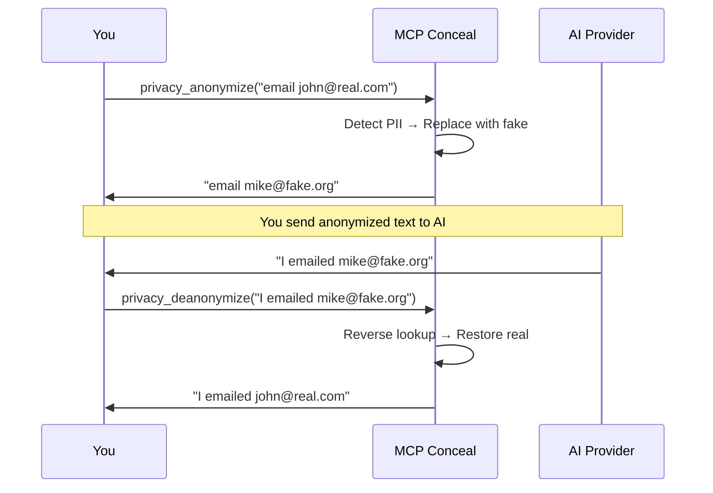

# MCP Conceal

An MCP privacy tool that pseudo-anonymizes PII and de-anonymizes responses. Runs as a **standalone MCP server** or as a **proxy** in front of another MCP server.



## Two Modes

### Standalone MCP Server

Exposes privacy tools directly. You decide what to anonymize.

```bash
mcp-server-conceal --mode server --keep-database
```

**Arguments:**

| Arg | Description |
|-----|-------------|
| `--mode server` | Run as standalone MCP server (required) |
| `--keep-database` | Preserve mappings across restarts (recommended) |
| `--config <path>` | Custom config file path (optional, auto-created if omitted) |
| `--log-level <level>` | Log verbosity: error, warn, info, debug, trace (default: info) |

**Tools exposed:**

| Tool | Description |
|------|-------------|
| `privacy_anonymize(text)` | Detect and replace PII with consistent fake values |
| `privacy_deanonymize(text)` | Restore original values from previously anonymized text |
| `privacy_status` | Show mapping count and entity type breakdown |

**MCP client config:**

```json
{
  "mcpServers": {
    "conceal": {
      "command": "mcp-server-conceal",
      "args": ["--mode", "server", "--keep-database"]
    }
  }
}
```

### Proxy Mode

Wraps another MCP server. Automatically anonymizes PII in requests sent to the target server and de-anonymizes responses coming back. No manual tool calls needed — all traffic is processed transparently.

```bash
mcp-server-conceal \
  --target-command python3 \
  --target-args "my-mcp-server.py" \
  --keep-database
```

**Arguments:**

| Arg | Description |
|-----|-------------|
| `--target-command <cmd>` | Command to launch the target MCP server (required) |
| `--target-args <args>` | Arguments for the target server (space-separated, supports quotes) |
| `--target-env <KEY=VALUE>` | Environment variables for the target (repeatable) |
| `--target-cwd <path>` | Working directory for the target server |
| `--keep-database` | Preserve mappings across restarts |
| `--config <path>` | Custom config file path |
| `--log-level <level>` | Log verbosity (default: info) |

**How it works:**

```
MCP Client ←stdio→ mcp-server-conceal ←stdio→ Target MCP Server
                         │
                    Anonymize requests (PII → fake)
                    De-anonymize responses (fake → real)
```

**Example — wrap a database MCP server for Claude Desktop:**

```json
{
  "mcpServers": {
    "database": {
      "command": "mcp-server-conceal",
      "args": [
        "--target-command", "python3",
        "--target-args", "database-server.py --host localhost",
        "--keep-database"
      ],
      "env": {
        "DATABASE_URL": "postgresql://localhost/mydb"
      }
    }
  }
}
```

In this setup, any PII in tool responses from the database server is anonymized before reaching the AI, and any fake values the AI uses in subsequent requests are de-anonymized before reaching the database server.

## Quick Start

### Option A: NER Detection (Recommended)

1. Install NER service: `pip install gliner fastapi uvicorn`
2. Start service: `python3 ner_service.py`
3. Run: `mcp-server-conceal --mode server --keep-database`

### Option B: LLM Detection (Legacy)

1. Install Ollama: [ollama.ai](https://ollama.ai)
2. Pull model: `ollama pull qwen2.5:1.5b-instruct-q4_K_M`
3. Verify: `curl http://localhost:11434/api/version`
4. Run: `mcp-server-conceal --mode server --keep-database`

Config is auto-created at `~/.config/mcp-server-conceal/mcp-server-conceal.toml`.

## Detection Backends

### NER (Named Entity Recognition) — Recommended

This branch uses a dedicated NER model ([GLiNER](https://github.com/urchade/GLiNER)) for PII detection instead of a generative LLM. NER models are purpose-built for entity recognition — faster, more accurate, and deterministic.

| | NER (GLiNER) | LLM (Ollama) |
|---|---|---|
| **Speed** | ~50-100ms | 5-60s |
| **Accuracy** | High — catches names, addresses, DOBs, orgs | Misses contextual PII |
| **Consistency** | Deterministic | Non-deterministic |
| **Resource usage** | ~500MB RAM | ~1-2GB RAM |
| **False positives** | Very low | Can hallucinate |

#### NER Setup

1. Install the NER service:

```bash
pip install gliner fastapi uvicorn
```

2. Start the service:

```bash
python3 ner_service.py
# Runs on http://localhost:8089
```

3. Configure in `mcp-server-conceal.toml`:

```toml
[detection]
mode = "regex_ner"

[ner]
endpoint = "http://localhost:8089"
labels = ["person", "email", "phone", "address", "date_of_birth", "organization", "credit_card", "ssn"]
```

### LLM (Ollama) — Legacy

The LLM approach uses a generative model to detect PII via prompting. Still supported but not recommended for production use.

| Model | Size | Best for |
|-------|------|----------|
| `qwen2.5:1.5b-instruct-q4_K_M` | ~1GB | Low storage, good for structured PII |
| `qwen2.5:3b-instruct-q4_K_M` | ~2GB | Better name/address detection |
| `llama3.2:3b` | ~2GB | Well-rounded |

## Detection Modes

| Mode | Latency | Accuracy | Configure |
|------|---------|----------|-----------|
| `regex_ner` | <200ms | Best | Regex first, NER for remainder |
| `regex_llm` | 5-60s | Good | Regex first, LLM for remainder |
| `regex` | <10ms | Good for structured PII | Pattern matching only |
| `llm` | 5-60s | Moderate | AI-only detection (legacy) |

## De-anonymization

The mapping database stores fake→real pairs. Consistent mapping ensures the same real PII always maps to the same fake value across sessions (when using `--keep-database`).

- **Forward table:** stores hash(original) → fake (for consistency)
- **Reverse table:** stores fake → original (for de-anonymization)

## Building from Source

```bash
git clone https://github.com/jsntn/mcp-server-conceal
cd mcp-server-conceal
cargo build --release
```

Requires Rust 1.85+. Binary: `target/release/mcp-server-conceal`

## Configuration

See `mcp-server-conceal.example.toml` for all options.

Custom LLM prompts can be placed at `~/.local/share/mcp-server-conceal/prompts/default.md`.

## Security

- **Reverse mappings** contain plaintext originals. Protect `~/.local/share/mcp-server-conceal/`.
- **LLM runs locally** via Ollama — no data leaves your machine.
- **Forward mappings** store hashes of originals (not plaintext).

## License

MIT License - see LICENSE file for details.

## Credits

Originally created by [Gianluca Brigandi](https://github.com/gbrigandi/mcp-server-conceal). This fork adds standalone MCP server mode, de-anonymization, and a smaller default LLM model.
